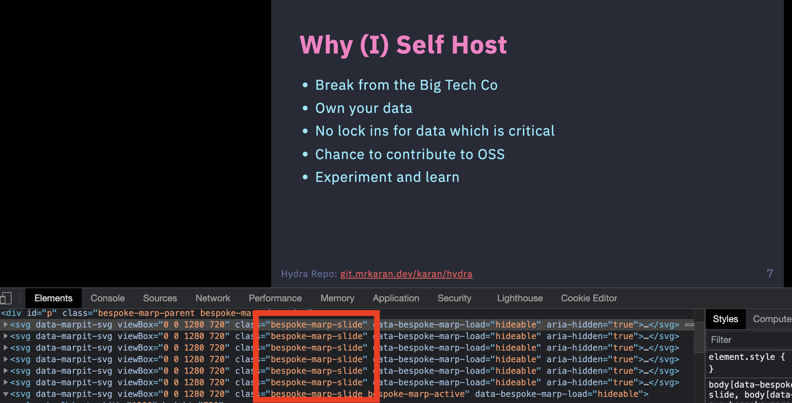

+++
title = "Code awesome presentations with markdown"
description = "Exploring the open source software(s) helping developers write presentations as code."
date = 2021-06-27
draft = true

[taxonomies]
tags = ["ppt", "markdown", "slidev"]
+++

## Backstory
Recently, I was going through the [self-hosting 101](https://talks.mrkaran.dev/talks/foss-united-apr-2021.html) slides by [Karan Sharma](https://mrkaran.dev/). Besides the content, the way the slides were presented as HTML pages caught my attention. I quickly opened up the inspect tool to find out more and found a few `bespoke-marp-slide` classes.

A quick search led me to [Marp](https://marp.app/). It was then I realized that unbeknownst, there was a whole bunch of software for making PPTs with existing OSS technologies. I found many JS packages targeted at this space. Some of them being [Slidev](https://sli.dev/), [RevealJS](https://revealjs.com/) and [ImpressJS](https://impress.js.org/#/bored).

## Slidev
For some unknown reason, I chose to learn Slidev. The slidev website is sleek and gives a glimpse of what you can do with the framework. I frequently use code, splits, tables, flow charts, and diagrams in my ppts. Slidev makes it easy to do all of these tasks and more.
* Code highlighting is built-in, and a first-class citizen.
* Easy splitting with `::left::`, `::right::` markdown extensions.
* Mermaid support for drawing diagrams and flow diagrams right in the markdown file.

The following features stand out and are probably exclusive only to Slidev
* Write live code in the ppt.
* Recording the presentation with picture in picture camera view.
* Crazy customization with HTML, CSS, and Vue.
* KaTeX support.
* Edit slides on the fly.

Overall, it offers all the features required by end-users on par (or even more) with popular proprietary software.

## Bonus
Some extra-ordinary developers took the idea even further, creating tools to make and present slides in the **TERMINAL** ! Here are some :
* [slides](https://github.com/maaslalani/slides) 
* [lookatme](https://github.com/d0c-s4vage/lookatme).

I continue to be surprised by the power of markdown. This very post is written in markdown. Though Slidev is currently (as of June 2021) in beta, it is ready to be used in your next presentation. It may not replace Powerpoint or Prezi for everyone. But anyone with a basic knowledge of markdown can learn it in no time. I will be tracking this project and would use it in my future presentations.
